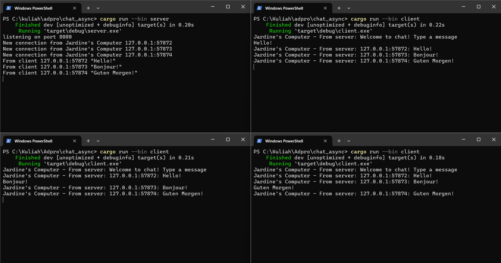

### **Running one server and three clients, how to do so.**
  
> Screenshot shows the program running, with one server and three client instances. **Here's how to run it:**
> - Open four terminal/console instances 
> - Navigate each terminal to the project directory
> - Run the server on one instance by executing: cargo run --bin server
> - For the other three instances, run the clients by executing: cargo run --bin client on each one
> - Each client connects to the server and is able to receive and send messages
 

> By typing a message in the client terminal, the message is sent to the server which then broadcasts it to all the connected clients. Each client will receive every messages sent, including the ones they sent themselves.
  

### **WHERE should you modify to change the ports? Websocket protocol, WHERE is it defined?**
> Both server and client are using the websocket protocol defined and implemented in the tokio_websockets crate. To modify the ports, we can change the TcpListener port number in the server.rs file and the ports used in ClientBuilder uri.
  

### **Details, WHY change it there?**
  
> Some changes are made in the server.rs file. Server already has the information, so we can just use it in the message that is being broadcasted back to the client. Thus, adding some information. 